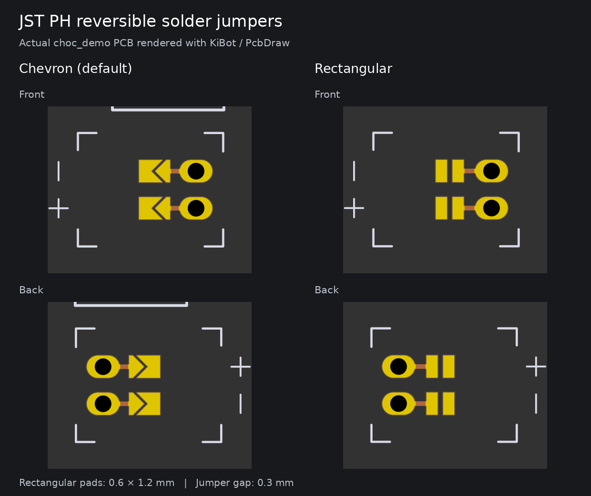

# JST PH rectangular jumper demo

`battery_connector_2` adds `use_rectangular_jumpers: true` to the reversible JST PH
connector on `choc_demo`, using the same footprint/parameter/adjust structure as
the other variants. It is placed in clear space below the existing chevron example.
Both are included on the mirrored board as well. The new entry is appended to
preserve the existing footprint references and net allocation order.

The footprint submodule is pinned to the rectangular-jumper implementation in
[ergogen-footprints PR #84](https://github.com/ceoloide/ergogen-footprints/pull/84).
Both tracked boards were regenerated against that revision with the repository's
locked Ergogen 4.1.0 dependencies. Changes to existing footprints in the board
files come from advancing the older footprint submodule to this revision.



[Full front board render](images/choc_demo-top.png) ·
[Full back board render](images/choc_demo-bottom.png)

## Reproduce

From the repository root:

```sh
git submodule update --init
npm ci
npm run debug
docker run --rm -w /board -v "$PWD:/board" \
  ghcr.io/inti-cmnb/kicad9_auto:latest \
  kibot -b pcbs/choc_demo.kicad_pcb -c docs/jumper-preview.kibot.yaml
docker run --rm -w /board -v "$PWD:/board" \
  ghcr.io/inti-cmnb/kicad9_auto:latest \
  python3 docs/render-jumper-comparison.py
```

The render uses the same KiBot/PcbDraw approach as corney-island, with the
`oshpark-afterdark` style and 900 dpi PNG output. The comparison crops the actual
front/back board images and adds labels; it does not redraw the pads or traces.
Docker writes outputs as root, as in the existing build script.
